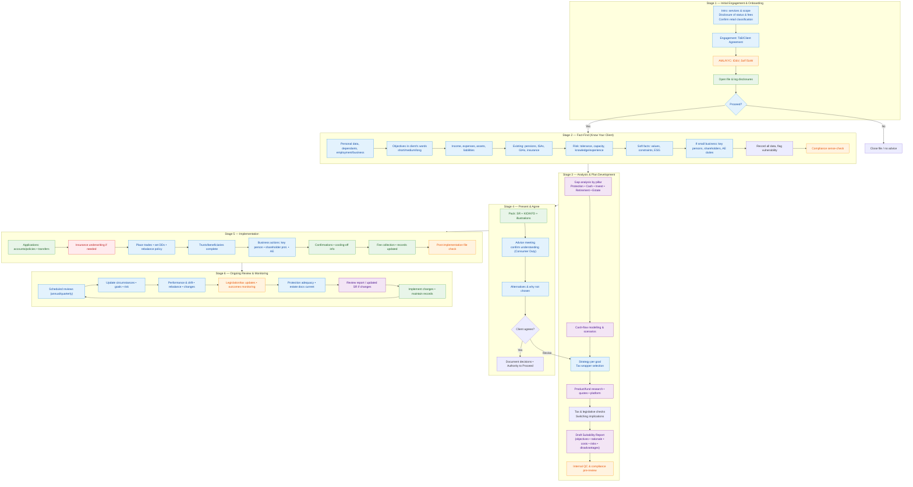

```mermaid
flowchart TD
  %% HOLISTIC FINANCIAL PLANNING — END TO END

  subgraph S1["Stage 1 — Initial Engagement & Onboarding"]
    A1["Intro: services & scope<br/>Disclosure of status & fees<br/>Confirm retail classification"]
    A2["Engagement: ToB/Client Agreement"]
    A3["AML/KYC: ID&V, SoF/SoW"]
    A4["Open file & log disclosures"]
    A5{"Proceed?"}
    A1-->A2-->A3-->A4-->A5
  end

  subgraph S2["Stage 2 — Fact-Find (Know Your Client)"]
    B1["Personal data, dependants, employment/business"]
    B2["Objectives in client's words<br/>short/medium/long"]
    B3["Income, expenses, assets, liabilities"]
    B4["Existing: pensions, ISAs, GIAs, insurance"]
    B5["Risk: tolerance, capacity, knowledge/experience"]
    B6["Soft facts: values, constraints, ESG"]
    B7["If small business: key persons, shareholders, AE duties"]
    B8["Record all data, flag vulnerability"]
    B9["Compliance sense-check"]
    B1-->B2-->B3-->B4-->B5-->B6-->B7-->B8-->B9
  end

  subgraph S3["Stage 3 — Analysis & Plan Development"]
    C1["Gap analysis by pillar<br/>Protection • Cash • Invest • Retirement • Estate"]
    C2["Cash-flow modelling & scenarios"]
    C3["Strategy per goal<br/>Tax wrapper selection"]
    C4["Product/fund research • quotes • platform"]
    C5["Tax & legislative checks<br/>Switching implications"]
    C6["Draft Suitability Report<br/>(objectives • rationale • costs • risks • disadvantages)"]
    C7["Internal QC & compliance pre-review"]
    C1-->C2-->C3-->C4-->C5-->C6-->C7
  end

  subgraph S4["Stage 4 — Present & Agree"]
    D1["Pack: SR + KID/KFD + illustrations"]
    D2["Advice meeting<br/>confirm understanding (Consumer Duty)"]
    D3["Alternatives & why not chosen"]
    D4{"Client agrees?"}
    D5["Document decisions • Authority to Proceed"]
    D1-->D2-->D3-->D4-->|"Yes"|D5
    D4-->|"Revise"|C3
  end

  subgraph S5["Stage 5 — Implementation"]
    E1["Applications: accounts/policies • transfers"]
    E2["Insurance underwriting if needed"]
    E3["Place trades • set DDs • rebalance policy"]
    E4["Trusts/beneficiaries complete"]
    E5["Business actions: key person • shareholder prot. • AE"]
    E6["Confirmations • cooling-off info"]
    E7["Fee collection • records updated"]
    E8["Post-implementation file check"]
    E1-->E2-->E3-->E4-->E5-->E6-->E7-->E8
  end

  subgraph S6["Stage 6 — Ongoing Review & Monitoring"]
    F1["Scheduled reviews (annual/quarterly)"]
    F2["Update circumstances • goals • risk"]
    F3["Performance & drift • rebalance • changes"]
    F4["Legislation/tax updates • outcomes monitoring"]
    F5["Protection adequacy • estate docs current"]
    F6["Review report / updated SR if changes"]
    F7["Implement changes • maintain records"]
    F1-->F2-->F3-->F4-->F5-->F6-->F7-->F1
  end

  A5-->|"No"|Z0["Close file / no advice"]
  A5-->|"Yes"|S2
  S2-->S3-->S4-->S5-->S6

  %% (Optional) role colouring (works in many renderers)
  classDef adviser fill:#e3f2fd,stroke:#1e88e5,color:#0d47a1;
  classDef para fill:#f3e5f5,stroke:#8e24aa,color:#4a148c;
  classDef admin fill:#e8f5e9,stroke:#43a047,color:#1b5e20;
  classDef compliance fill:#fff3e0,stroke:#fb8c00,color:#e65100;
  classDef provider fill:#ffebee,stroke:#e53935,color:#b71c1c;
  class A1,A2,A3,A5,B1,B2,B3,B4,B5,B6,B7,C3,D2,D3,E3,E4,E5,F1,F2,F3,F5 adviser;
  class C1,C2,C4,C6,F6 para;
  class A4,D1,E1,E6,E7,F7 admin;
  class A3,B9,C7,E8,F4 compliance;
  class E2 provider;
```
