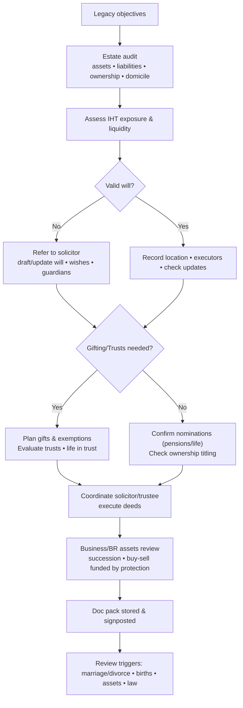

```mermaid
flowchart TD
  A["Legacy objectives"] --> B["Estate audit<br/>assets • liabilities • ownership • domicile"]
  B --> C["Assess IHT exposure & liquidity"]
  C --> D{"Valid will?"}
  D -->|"No"| E["Refer to solicitor<br/>draft/update will • wishes • guardians"]
  D -->|"Yes"| F["Record location • executors • check updates"]
  E --> G
  F --> G{"Gifting/Trusts needed?"}

  G -->|"Yes"| H["Plan gifts & exemptions<br/>Evaluate trusts • life in trust"]
  G -->|"No"| I["Confirm nominations (pensions/life)<br/>Check ownership titling"]

  H --> J["Coordinate solicitor/trustee<br/>execute deeds"]
  I --> J
  J --> K["Business/BR assets review<br/>succession • buy-sell funded by protection"]
  K --> L["Doc pack stored & signposted"]
  L --> M["Review triggers: marriage/divorce • births • assets • law"]
```
