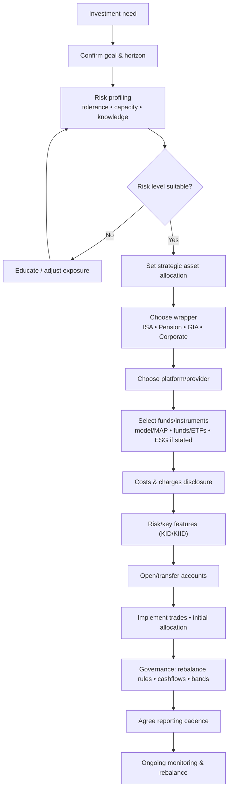

```mermaid
flowchart TD
  A["Investment need"] --> B["Confirm goal & horizon"]
  B --> C["Risk profiling<br/>tolerance • capacity • knowledge"]
  C --> D{"Risk level suitable?"}
  D -->|"No"| E["Educate / adjust exposure"] --> C
  D -->|"Yes"| F["Set strategic asset allocation"]

  F --> G["Choose wrapper<br/>ISA • Pension • GIA • Corporate"]
  G --> H["Choose platform/provider"]
  H --> I["Select funds/instruments<br/>model/MAP • funds/ETFs • ESG if stated"]

  I --> J["Costs & charges disclosure"]
  J --> K["Risk/key features (KID/KIID)"]
  K --> L["Open/transfer accounts"]
  L --> M["Implement trades • initial allocation"]
  M --> N["Governance: rebalance rules • cashflows • bands"]
  N --> O["Agree reporting cadence"]
  O --> P["Ongoing monitoring & rebalance"]
```
