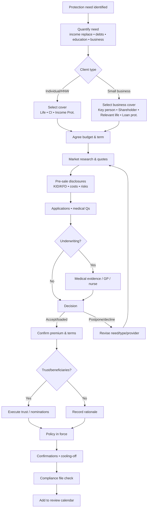

```mermaid
flowchart TD
  A["Protection need identified"] --> B["Quantify need<br/>income replace • debts • education • business"]
  B --> C{"Client type"}
  C -->|"Individual/HNW"| D["Select cover<br/>Life • CI • Income Prot."]
  C -->|"Small business"| E["Select business cover<br/>Key person • Shareholder • Relevant life • Loan prot."]

  D --> F["Agree budget & term"]
  E --> F
  F --> G["Market research & quotes"]
  G --> H["Pre-sale disclosures<br/>KID/KFD • costs • risks"]
  H --> I["Applications • medical Qs"]

  I --> J{"Underwriting?"}
  J -->|"Yes"| K["Medical evidence / GP / nurse"]
  J -->|"No"| L["Decision"]

  K --> L
  L -->|"Accept/loaded"| M["Confirm premium & terms"]
  L -->|"Postpone/decline"| N["Revise need/type/provider"] --> G

  M --> O{"Trust/beneficiaries?"}
  O -->|"Yes"| P["Execute trust / nominations"]
  O -->|"No"| Q["Record rationale"]

  P --> R["Policy in force"]
  Q --> R
  R --> S["Confirmations • cooling-off"]
  S --> T["Compliance file check"]
  T --> U["Add to review calendar"]
```
