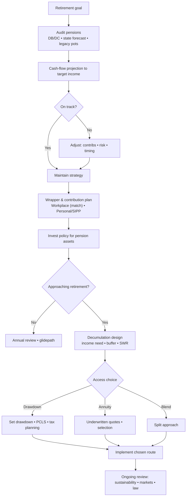

```mermaid
flowchart TD
  A["Retirement goal"] --> B["Audit pensions<br/>DB/DC • state forecast • legacy pots"]
  B --> C["Cash-flow projection to target income"]
  C --> D{"On track?"}
  D -->|"No"| E["Adjust: contribs • risk • timing"]
  D -->|"Yes"| F["Maintain strategy"]
  E --> F

  F --> G["Wrapper & contribution plan<br/>Workplace (match) • Personal/SIPP"]
  G --> H["Invest policy for pension assets"]

  H --> I{"Approaching retirement?"}
  I -->|"No"| J["Annual review • glidepath"]
  I -->|"Yes"| K["Decumulation design<br/>income need • buffer • SWR"]

  K --> L{"Access choice"}
  L -->|"Drawdown"| M["Set drawdown • PCLS • tax planning"]
  L -->|"Annuity"| N["Underwritten quotes • selection"]
  L -->|"Blend"| O["Split approach"]

  M --> P["Implement chosen route"]
  N --> P
  O --> P
  P --> Q["Ongoing review: sustainability • markets • law"]
```
