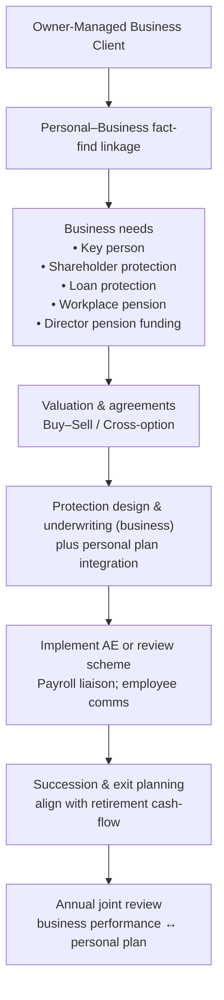

```mermaid
flowchart TD
  A["Owner-Managed Business Client"] --> B["Personal–Business fact-find linkage"]
  B --> C["Business needs<br/>• Key person<br/>• Shareholder protection<br/>• Loan protection<br/>• Workplace pension<br/>• Director pension funding"]
  C --> D["Valuation & agreements<br/>Buy–Sell / Cross-option"]
  D --> E["Protection design & underwriting (business)<br/>plus personal plan integration"]
  E --> F["Implement AE or review scheme<br/>Payroll liaison; employee comms"]
  F --> G["Succession & exit planning<br/>align with retirement cash-flow"]
  G --> H["Annual joint review<br/>business performance ↔ personal plan"]
```
